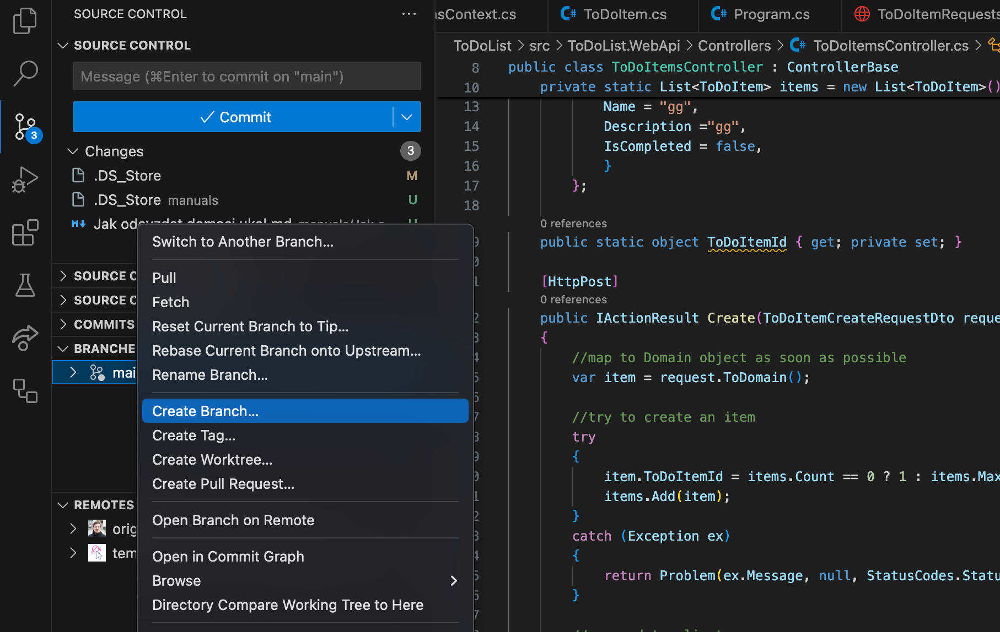
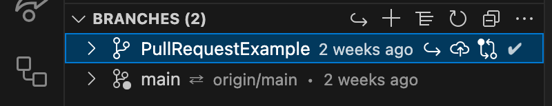
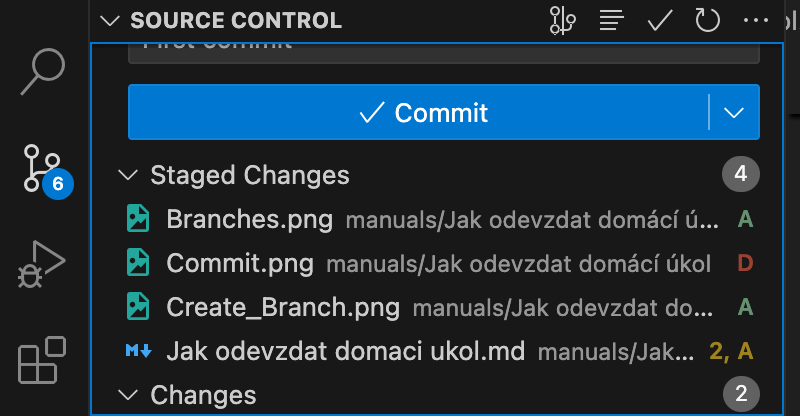

# Jak odevzdat domácí úkol

V tomhle návodu si vysvětlíme, jak si ve VS Code vytvořit `PullRequest` z nové větve a proč to je nejlepší forma odevzdávání domácích úkolů.

- [Jak odevzdat domácí úkol](#jak-odevzdat-domácí-úkol)
  - [Vytvoření vlatní větve a Pull Requestu](#vytvoření-vlatní-větve-a-pull-requestu)
  - [Zapracování nejnovějších změn z šablony (při každé aktualizaci - z větve main)](#zapracování-nejnovějších-změn-z-šablony-při-každé-aktualizaci---z-větve-main)
    - [Pokud se ti ukázalo v konzoli něco podobného jako](#pokud-se-ti-ukázalo-v-konzoli-něco-podobného-jako)
    - [Pokud se ti však ukázalo v konzoli něco podobného jako](#pokud-se-ti-však-ukázalo-v-konzoli-něco-podobného-jako)
    - [Řešení Merge Conflictů](#řešení-merge-conflictů)

## Vytvoření vlatní větve a Pull Requestu

Ve Visual Stiudiu Code ve přepneme do třetí záložky `Source Control`. V ní vidíme v záložce `Source Control` aktuální změny našeho repozitáře a v záložce `Branches` lokální větve. Vytvoříme si z naší hlavní větve Main novou větev kliknutím pravým tlačítkem myši na větev main a kliknutím na `Create branch`.



Zvolíte si jméno vaší větve (například PullRequestExample v mém případě, nebo Assignment_5.1 u vás) a stisknete Enter.
Následně zvolíte `Create & Switch to Branch`, takže se vám větev vytvoří a rovnou vás to na ní přepne.



Následně uděláme commit našich změn v nově vytvořené větvi:




## Zapracování nejnovějších změn z šablony (při každé aktualizaci - z větve main)

Příkazem `git pull template main --allow-unrelated-histories`\
ve tvaru `git pull <odkud> <kam> <--allow-unrelated-histories = ignoruj, že repozitáře nemají stejnou historii>`\
si načteme aktuální stav šablony v remotu `template` a pokusíme se ho zamergovat do naší hlavní větve `main`.

Ve VSCode pak v `Source Control -> Source Control` uvidíš `Changes`, které se k tobě dostaly zapracováním šablony do tvého repozitáře.\
**V tuto chvíli máš vyhráno! Přidej message commitu, stagni všechny změny, commitni a pushni a máš hotovo!**
Pokud se něco pokazilo, mrkni níže.

### Pokud se ti ukázalo v konzoli něco podobného jako

```text
hint: You have divergent branches and need to specify how to reconcile them.
hint: You can do so by running one of the following commands sometime before
hint: your next pull:
hint: 
hint:   git config pull.rebase false  # merge
hint:   git config pull.rebase true   # rebase
hint:   git config pull.ff only       # fast-forward only
hint: 
hint: You can replace "git config" with "git config --global" to set a default
hint: preference for all repositories. You can also pass --rebase, --no-rebase,
hint: or --ff-only on the command line to override the configured default per
hint: invocation.
fatal: Need to specify how to reconcile divergent branches.
```

V tom případě musíme zajistit, jak chceme s gitem zacházet, když budeme mít změny ze dvou různých zdrojů: našeho a šablony. Stačí zavolat příkaz `git config pull.rebase false` a tím si zajistit, že každá takováhle změna se bude projevovat jako nový merge request do naší větve.

### Pokud se ti však ukázalo v konzoli něco podobného jako


**musíme udělat ještě krok navíc.**

Pokud se něco změnilo v některém souborů šablony a zároveň jsi do stejného souboru zasahovala sama, s největší pravděpodobností nastane `Merge Conflict`!

Ten uvidíme pak v `Source Control -> Source Control`
pod `Merge Changes` (soubory s vykřičníkem). Tyto merge conflicty musíme opravit sami.


### Řešení Merge Conflictů

Kliknutím na soubor se lze podívat, kde jde problém

Zde například v tom, že v šabloně se změnil README.md, kde se přejmenovala složka z **/project** (current change - změna v našem repozitáři) na **/ToDoList** (incoming change - změna ze šablony)

Pro vyřešení problému vpravo dole klikneme na tlačítko `Resolve in Merge Editor` 

Objeví se nám nové okno

vlevo máme `Incoming Change` (změny ze šablony), vpravo `Current Change` (změny v našem repozitáři).\
Pod nimi pak máme `Result`. Tato `Result` oblast nám ukáže, jak bude vypadat konečný soubor README.md.

Poznámka: Pro `Markdown` dokumenty je tento zabudovaný editor trochu slabší, nedokáže zvýraznit pouze ty řádky, kde je problém :( U ostatních typů souborů byste měli vidět zvýrazněné pouze ty řádky, které je třeba opravit (tam kde je konflikt)

V C#3 budeme po vás chtít, abyste si nakupovali šablonu, abychom měli všichni stejný kód.
To uděláme tak, že klikneme na tlačítko `Accept All Changes from Left`, po jehož kliknutí pak v `Result` bude verze derivovaná z šablony (veškeré konflikty se vyřeší kódem ze šablony).


S takto vyřešenými problémy klikneme v pravém dolním rohu na `Complete Merge` 

Tento postup zopakuj pro všechny soubory, ve kterých je Merge Conflict, v source control pak nebude ani jeden soubor s vykřičníky


Nezapomeň na vyplnění zprávy, poté commitni a pushni.
Hotovo!
